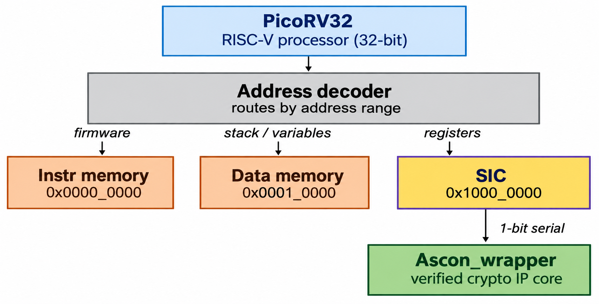
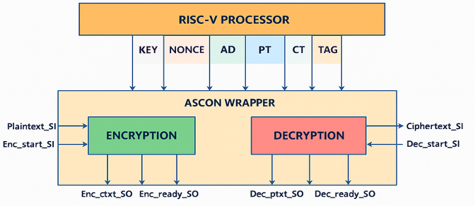
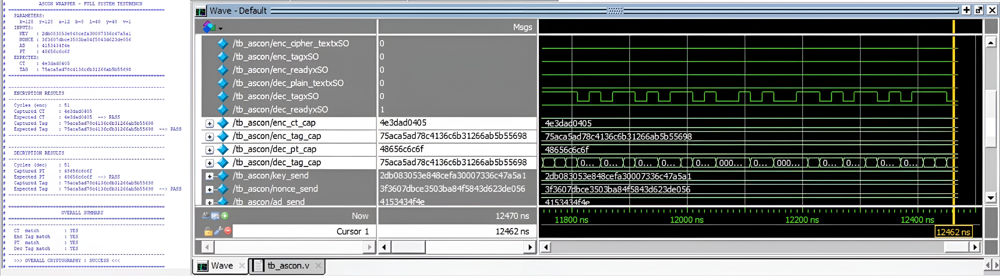
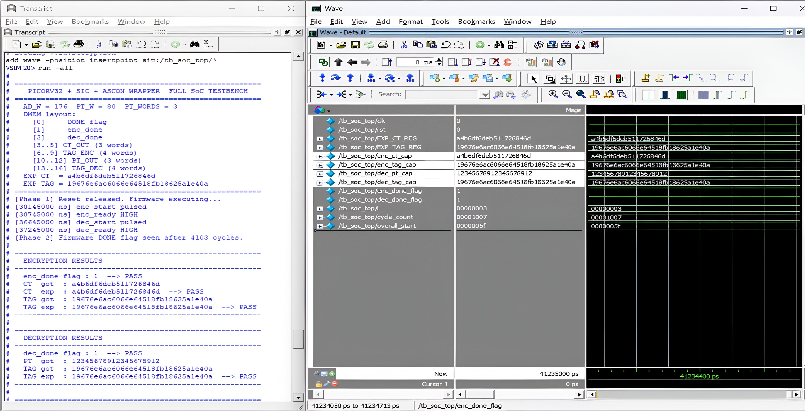
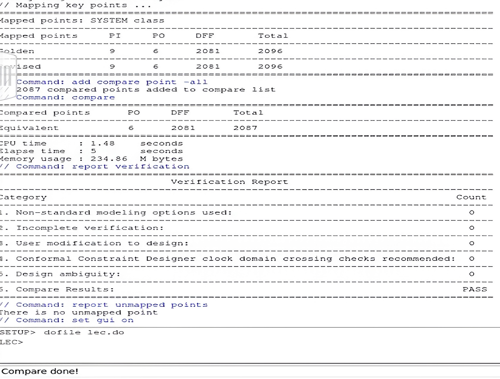
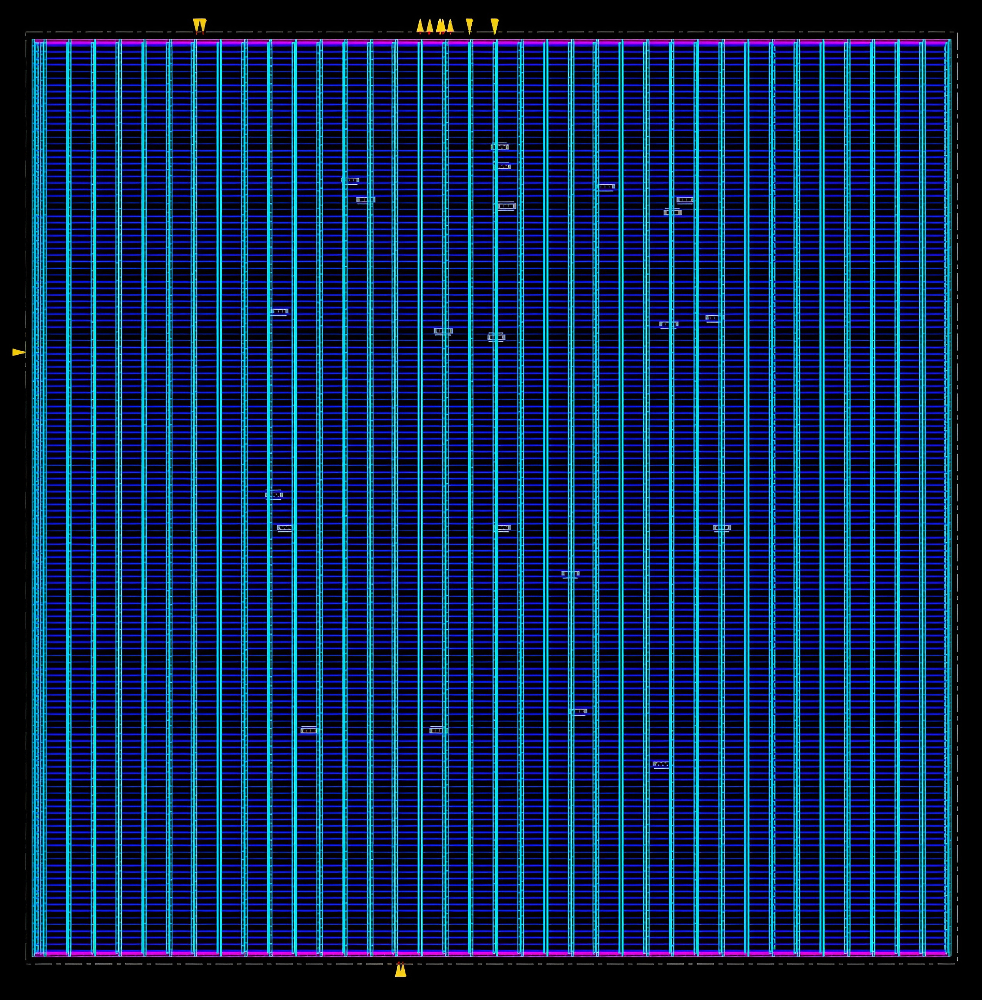
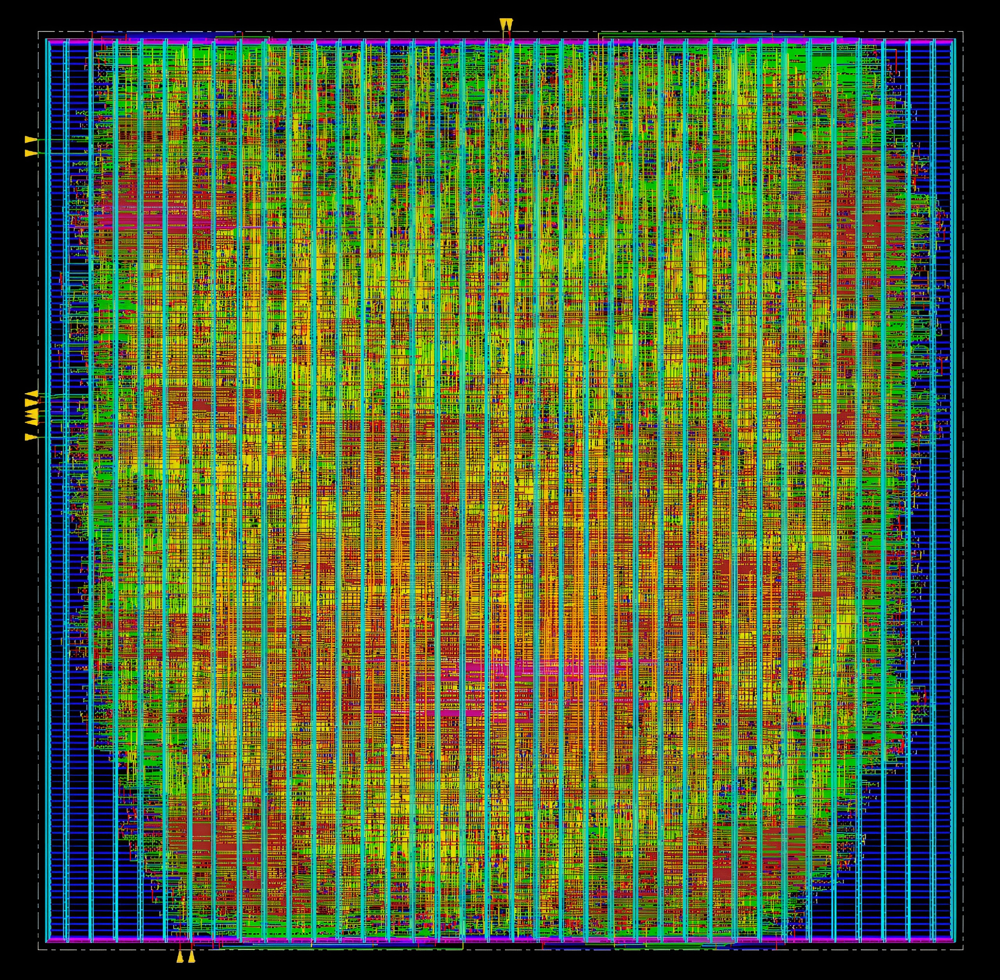

# ASCON-128a Lightweight Cryptographic Accelerator with RISC-V SoC Integration

A hardware cryptographic accelerator implementing the NIST-standardized ASCON authenticated encryption algorithm (SP 800-232), integrated as a memory-mapped peripheral into a RISC-V (PicoRV32) System-on-Chip, and carried through a complete 90nm ASIC physical design flow using Cadence EDA tools.

> Built as part of a B.Tech ECE final-year project at VIT Chennai, under the guidance of Dr. Jean Jenifer Nesam J.

---

## Project Motivation

Most academic ASCON implementations stop at "the algorithm works in simulation." This project goes further by taking the ASCON accelerator through a complete ASIC implementation flow, including synthesis and physical layout, resulting in a design that is DRC-clean and timing-clean. The accelerator was also integrated into a processor-driven SoC at the RTL level and functionally verified through simulation, demonstrating both the physical realization of the ASCON hardware and its integration within a processor-based system.

**The ASIC physical design flow (synthesis, floorplan, place & route, signoff) was run on the standalone ASCON accelerator core** — the numbers below describe that core, not the full SoC. The RISC-V + SIC + ASCON SoC integration was verified functionally at the RTL level through simulation.

**Key numbers (ASCON accelerator core):**

| Metric              | Value              |
|----------------------|--------------------|
| Technology node      | 90nm CMOS (gpdk90) |
| Max frequency         | 250 MHz            |
| Throughput            | 711.11 Mbps        |
| Core area              | 98,008.71 µm²      |
| Gate count             | 25.899 kGE         |
| Total power             | 17.554 mW         |
| Energy efficiency        | 40.51 Gbits/J    |
| Post-route timing slack   | +0.013 ns       |
| DRC / connectivity violations | 0           |
| LEC (RTL vs. gate-level)   | PASS            |

---

## Architecture

The SoC integrates a lightweight RISC-V processor (PicoRV32) with a dedicated ASCON hardware core, connected through a custom **Serial Interface Controller (SIC)** and a memory-mapped address decoder.

<a href="docs/images/architecture.png"></a>

The processor writes inputs (KEY, NONCE, AD, PT) into SIC registers, triggers encryption or decryption, and reads back the resulting ciphertext/plaintext and authentication tag — all through the SIC's memory-mapped interface described above.

<a href="docs/images/process_flow.png"></a>

### Module hierarchy

```
soc_top
 ├── picorv32          — RISC-V processor core (third-party, see Acknowledgements)
 ├── instr_mem         — instruction ROM, loaded from firmware.hex
 ├── data_mem          — data SRAM, byte-enable writes
 ├── ascon_sic         — bus-facing register map + serializer/deserializer
 └── Ascon              — top-level ASCON module; exposes a serial interface
      └── AsconCore     — encryption/decryption FSM (parallel 320-bit state)
           └── Permutation
                ├── roundconstant
                ├── sub_layer
                └── linear_layer
```

> **Note on the address decoder:** Unlike the block diagram above, the address decoder is not a separate RTL module/file — it's implemented inline within `soc_top.v` as a small set of address-range comparisons (`sel_imem`, `sel_dmem`, `sel_ascon`) and the accompanying read-data/ready muxes. The diagram represents the conceptual architecture; see `soc_top.v` for the literal implementation.

The processor controls encryption/decryption entirely through **simple load/store instructions** to memory-mapped SIC registers — no standard bus protocol was used; the SIC handles the parallel-to-serial conversion between the processor's 32-bit interface and the ASCON core's serial datapath directly.

---

## Verification methodology

Verification was structured across three levels of integration, each with its own self-checking testbench, plus a formal verification step after synthesis:

1. **Core-level (`tb_ascon.v`).** Drives the `Ascon` module's serial interface directly with a NIST test vector, running one encryption followed by one decryption, and automatically compares the captured ciphertext/plaintext and authentication tags against expected values.

2. **SIC integration (`tb_sic.v`).** Drives the ASCON SIC entirely through its memory-mapped bus interface (as PicoRV32 would), validating the register map, bus protocol, and the SIC's serialization/deserialization to and from the ASCON core — catching integration bugs that core-level testing alone would miss.

3. **Full SoC (`tb_soc_top.v`).** Only drives clock and reset; PicoRV32 executes actual compiled firmware (`firmware.hex`), which performs encryption and decryption via the SIC and writes results to data memory. The testbench polls for a firmware completion flag, then reads and verifies the results — the closest level to how the design would actually run in deployment.

4. **Formal verification (Logical Equivalence Checking).** After synthesis, Cadence LEC was used to formally prove that the gate-level netlist of the standalone ASCON core is logically equivalent to its RTL description — for both encryption and decryption datapaths — with zero unmapped points and a final `PASS` compare status.


**_Core-level testbench waveform_** (`tb_ascon.v`):

<a href="docs/images/ascon_core_waveform.jpg"></a>

**_Full SoC testbench waveform_** (`tb_soc_top.v`):

<a href="docs/images/soc_waveform.jpg"></a>

**_LEC (RTL vs. gate-level) equivalence check — PASS:_**

<a href="docs/reports/lec.jpg"></a>

---

## Physical design flow (ASCON core only)

| Stage                | Tool              |
|------------------------|-------------------|
| RTL Simulation           | Cadence NCSim (NCLaunch) |
| Logic Synthesis           | Cadence Genus     |
| Timing Constraints (SDC)   | Manually written  |
| Static Timing Analysis      | Cadence Genus / Innovus |
| Formal Equivalence Check     | Cadence LEC     |
| Floorplanning / Placement / CTS / Routing | Cadence Innovus |
| Physical Verification (DRC/Connectivity) | Cadence Innovus |


**_Floorplan of the ASCON core_**

<a href="docs/images/floorplan.jpg"></a>

**_Post-route placement and routing_**

<a href="docs/images/PnR.jpg"></a>

Post-route results: **zero DRC violations, zero connectivity errors, positive timing slack (+0.013 ns) across all 2,091 analyzed paths**, with 100% timing coverage across setup, pulse width, and external delay checks.

> Screenshots of the post-route timing, power, and DRC summary reports (Cadence Innovus) are available in [`/reports`](docs/reports). Raw `.rpt` log files were not preserved from this specific final run.

---

## Known limitations & honest scope

- The **ASIC physical design flow (synthesis, floorplan, place & route, DRC/timing signoff) was run on the standalone ASCON core only**, not on the full RISC-V SoC. The SoC integration was verified functionally at the RTL level through simulation.
- Physical design signoff on the ASCON core covers **DRC, connectivity, and timing at the block/core level**; full-chip I/O pad-ring integration and LVS were not performed, consistent with an IP-core-level (rather than full-chip tapeout) design flow.
- The processor-to-accelerator interconnect uses a **custom memory-mapped + bit-serial interface** (via the SIC), not a standardized bus protocol (e.g., AXI-Lite/APB) — a natural ext step for improved IP reusability.

## Future work

- Carry the full SoC (PicoRV32 + SIC + ASCON) through synthesis and physical implementation, not just the standalone ASCON core and replace the custom serial interface with a standard bus protocol (AXI-Lite/APB) for broader SoC reusability.
- Extend to support additional ASCON variants and other parameters via a configurable and scalable design.
- Explore round-level pipelining and parallel interface optimizations to improve throughput further.
- Technology scaling to advanced CMOS nodes will also be explored to evaluate robustness under real-world operating conditions

---

## Acknowledgements

This project integrates [PicoRV32](https://github.com/YosysHQ/picorv32) (© Claire Xenia Wolf, ISC License) as the RISC-V processor core. The processor itself was not authored as part of this project — our work was the ASCON accelerator, SIC, SoC integration, firmware, and testbenches built around it. `Rtl/picorv32.v` is included unmodified, with its original license header intact.

## Team

- **Kanthi Ram A** — RTL design (ASCON core, SIC, SoC integration), firmware, synthesis and physical design   
- Danus D - ASCON algorithm analysis, Python-based random test vector generation and verification testbench design
- Pradesh Kumar M - Comparative research on lightweight cryptographic algorithms, RISC-V SoC Architecture and RTL code review

*Guided by Dr. Jean Jenifer Nesam J, School of Electronics Engineering, VIT Chennai.*
